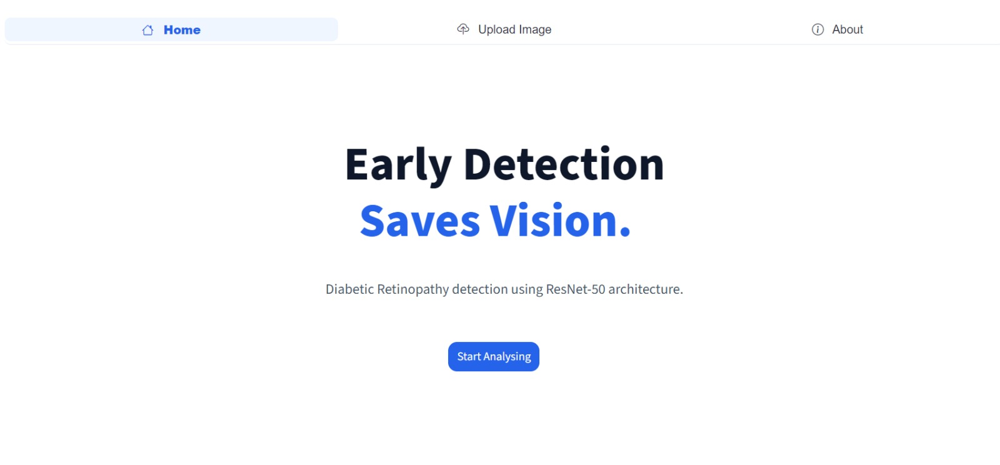
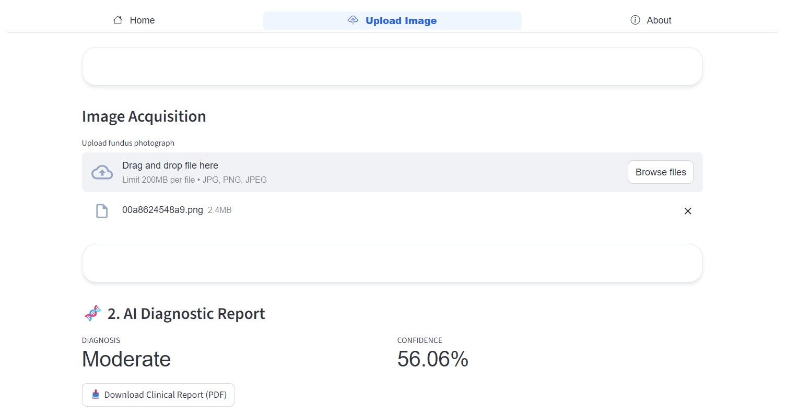
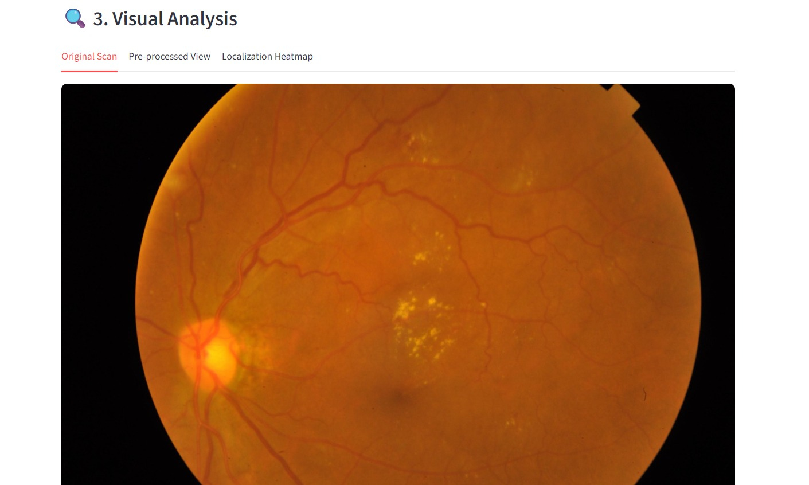
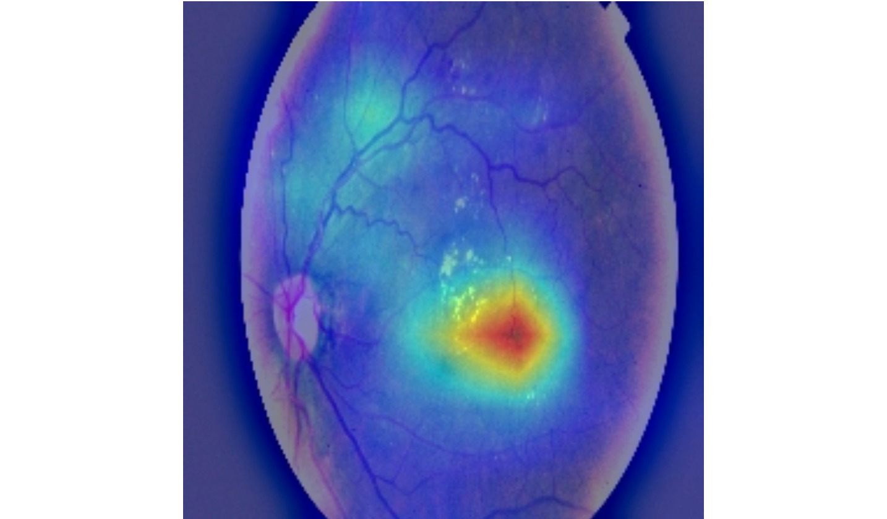
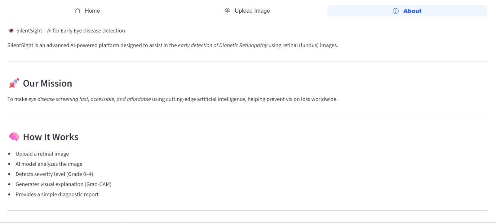
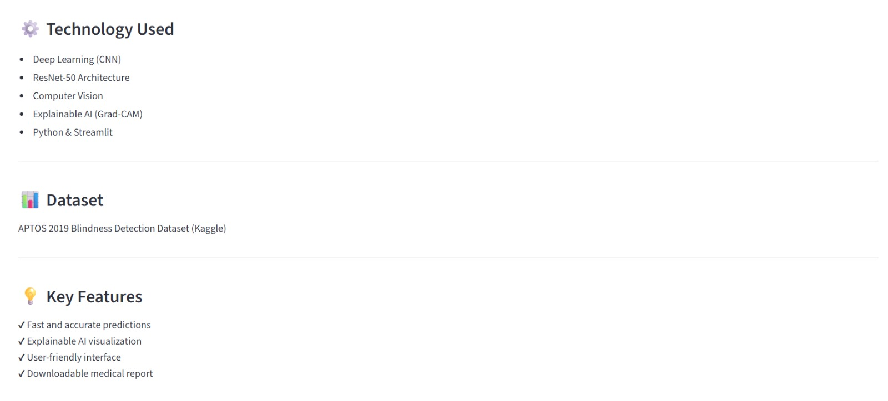
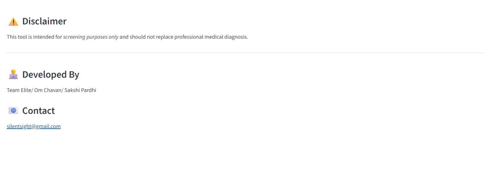
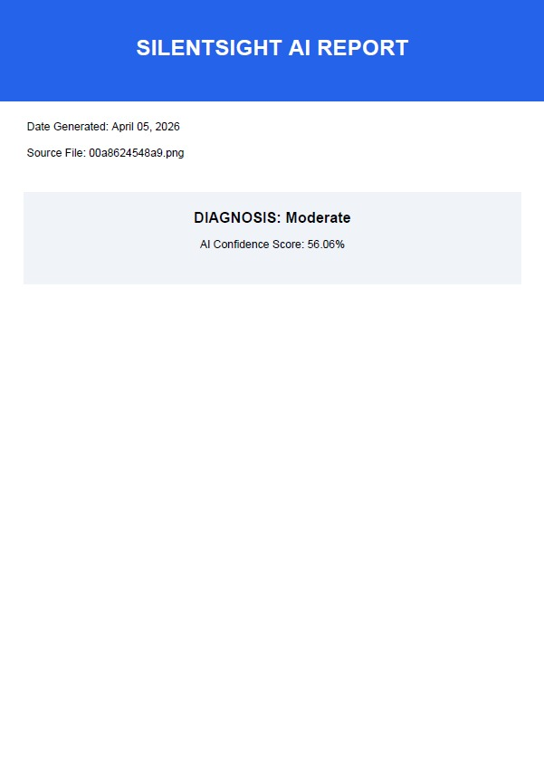
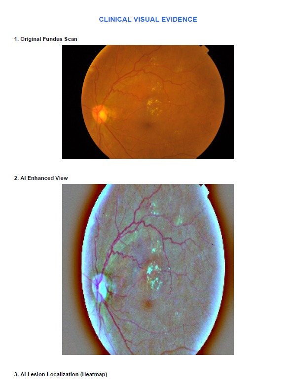
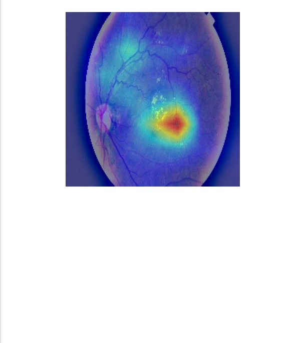

# Silentsight 👁️

## 🔍 Overview
Silentsight is an AI-powered system for early detection of Diabetic Retinopathy using retinal images.

## 🚨 Problem
Diabetic Retinopathy is a leading cause of blindness, especially in rural areas where eye specialists are limited.

## 💡 Solution
Our system uses deep learning to analyze retinal images and detect early signs of the disease.

## ⚙️ Features
- Early detection of Diabetic Retinopathy
- Severity score (0–4)
- Grad-CAM heatmaps for explainability
- Works on low-power devices

## 🧠 Technology Used
- Python
- TensorFlow / PyTorch
- OpenCV
- ResNet-50 CNN

## 📊 Working
1. Input retinal image  
2. Preprocessing  
3. Feature extraction using ResNet-50  
4. Classification  
5. Output: Severity score + Heatmap  

## 🎯 Impact
- Prevents blindness  
- Helps rural healthcare  
- Reduces cost  

## 🙌 Team
Team Elite 

## 🙌 Developed By

Sakshi Pardhi | Om Chavan

## Screenshots

